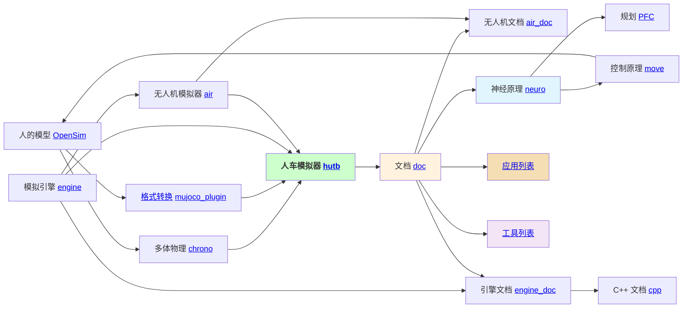
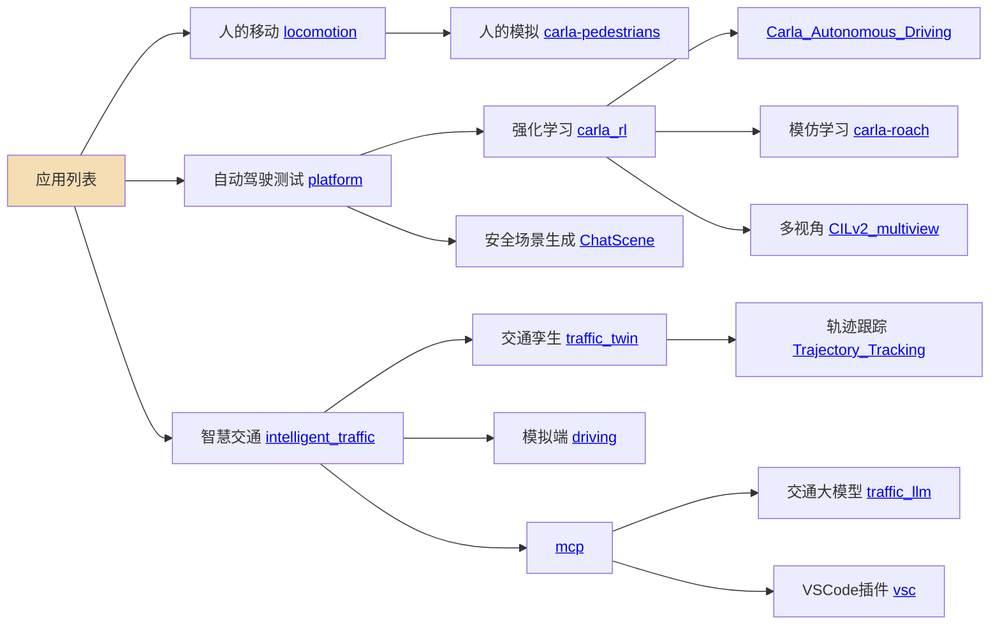
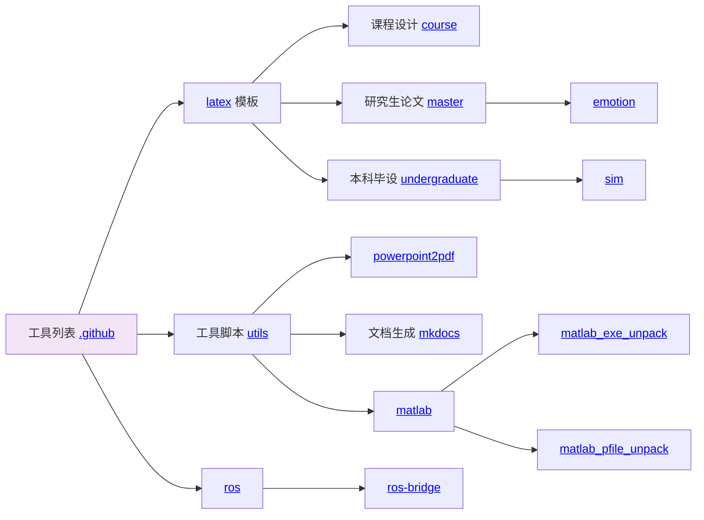

# OpenHUTB

OpenHUTB 简单来说是面向人机共生与智能载具研究、教学和开发的开源仿真社区，提供影视级物理模拟器、开放数字资产，以及感知、规划、控制和场景生成工具。该社区具体提供一个包含人车代理（学术研究）、模拟器（技术开发包括数据驱动、机理仿真、界面渲染）、现实场景（艺术增强）的 [模拟器](https://openhutb.github.io) ，代理包括[感知](https://openhutb.github.io/doc/algorithms/perception/) （连接）、[规划](https://openhutb.github.io/doc/algorithms/planning/) （符号）、[控制](https://openhutb.github.io/doc/algorithms/control/) （行为）；模拟器包括Python与C++的接口（正向创建、反向构建）、LibCarla、虚幻引擎插件；现实场景包括 [静态场景孪生](https://openhutb.github.io/doc/adv_digital_twin/) 、[动态场景孪生](https://github.com/OpenHUTB/traffic_twin/) 。

以下为新手快速上手栏目：

[🚀 快速开始](https://github.com/OpenHUTB/hutb#使用示例) · [📖 在线文档](https://openhutb.github.io/) · [🧪 运行示例](https://github.com/OpenHUTB/doc/tree/master/src/examples) · [🤝 参与贡献](https://github.com/OpenHUTB/.github/blob/master/CONTRIBUTING.md) · [💬 提问与讨论](https://github.com/orgs/OpenHUTB/discussions)

你可以用 OpenHUTB 做什么？
- **研究与教学**：学习感知、规划、控制和具身智能算法。
- **仿真与验证**：在可重复的场景中开发、训练和验证算法。
- **场景与内容开发**：使用开放的城镇、建筑、车辆、行人和道具资产创建仿真环境。

核心入口

- 🟡 **[hutb 人车模拟器](https://github.com/OpenHUTB/hutb)** — 提供下载工具、Python API 和交通生成示例，目前持续开发中。
- 📚 **[doc 人车文档](https://github.com/OpenHUTB/doc)** — 提供安装、Python API、场景制作和开发文档。

### 研究与实验项目

- 🧪 **[traffic_twin 人车孪生](https://github.com/OpenHUTB/traffic_twin)** — 交通数字孪生相关研究和示例，使用前请查看仓库说明。
- 🧠 **[neuro 神经原理](https://github.com/OpenHUTB/neuro)** — 感知和神经网络相关研究内容。
- 🧭 **[PFC 规划](https://github.com/OpenHUTB/PFC)** — 规划相关研究内容。
- 🎮 **[move 控制原理](https://github.com/OpenHUTB/move)** — 运动控制与生物力学相关研究内容。

人车模拟器的技术架构入下图所示：

<!--所有项目关系的思维导图。-->
<!-- 使用markmap进行编辑并生成svg：https://markmap.js.org/repl -->
<!-- 在profile/markmap.md中保存图的数据 -->
<!-- svg图片预览：https://raw.githack.com/ -->

## 社区项目之间的关系

### 应用列表

### 工具列表

